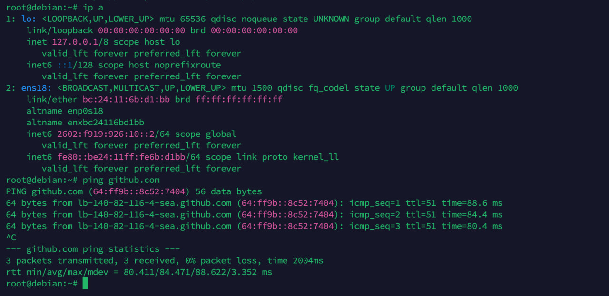

# NAT64 form Tayga

NAT64/DNS64 早就不是什么稀罕的技术，准确说它是为了帮助only ipv6用户过渡实现可以访问ipv4网络一项协议。被[RFC6146](https://www.rfc-editor.org/rfc/pdfrfc/rfc6146.txt.pdf)所定义。\
\--------\
我们使用Linux Debian做实验，希望这小小的tayga配置可以帮助您理清思路。\
我希望并呼吁 各位ISP 尽早为您的only ipv6客户至少support NAT64/DNS64这项服务。\


您截止到这篇文章2025年为止，目前\[network type]Carrier(CGN)/Eyeball尽管绝大多数声成支持ipv6网络。\
但是几乎包括GitHub,Discord,speedtest.net,这样的网站尽管通过CDN分发等技术，only ipv6网络用户可以下载来自贵网的文件，但是内在api等多个服务仍然还是指向了纯ipv4访问，或者说有太多的服务的ipv6都不是足以脱离ipv4正常访问的。\
\
\-------------\
我知道很多Only ipv6的用户借助cloudflare提供的warp来解锁ipv4网络支持。但是不是所有的ISP to Cloudflare的网络容量都是足够的。并且通过Cloudflare这样CDN确实有效缓解了您的IP痕迹信息,但这不是给我找一个理由不来介绍这样的工具。\
我相信作为Carrier网络的您来说，一台only ipv6的机器，在访问各种ipv4内容为难的情况下，NAT64/DNS64这项服务是您应当部署的。\
\
\---------

言归正传，在Linux上面实现NAT64这项服务其实就是地址转换这项功能并不是很复杂的一件事情。市面上有除tayga外Jool,Ecdysis等工具軟體。\
但是我們這篇文章僅介紹tagay的NAT64搭建\
\
在Debian中 即可完成安裝.

<pre class="language-wasm"><code class="lang-wasm"><strong>apt update
</strong>apt install tayga -y
</code></pre>

您可以在`/etc/tayga.conf`中找到它的配置&#x20;

您可以自行cp備份默認的配置文件，但是我以我的配置文件向您說明

```
root@pve:cat /etc/tayga.conf

tun-device nat64
#tun接口請保留這項配置這是tayga工作的必要需求。
ipv4-addr 192.168.30.200
#請自行替換這裡的 RFC1912 地址。
# [新增] Tayga 自身的 IPv6 地址 
# (必须是你物理局域网 2602:f919:926:10::/64 网段内的一个空闲IP)
ipv6-addr 2602:f919:926:10::200
# 注意：Tayga 使用 'dynamic-pool' 而不是 'ipv4-pool'
dynamic-pool 192.168.30.0/24

# 注意：Tayga 使用 'prefix' 而不是 'nat64-prefix'
prefix 64:ff9b::/96

# 用來記載NAT轉換的日誌路徑
data-dir /var/spool/tayga
```

`192.168.30.0/24` rage 這是RFC1912所定義的局域網常見prefix地址。\
`2602:f919:926:10::200`也只是這裡tayga使用時所檢測到的地址轉換preifx address。\
`2602:f919:926:10::/64`這個地址塊被我分配給 我的 Linux路由器下面的設備。因為它們才是only ipv6的環境設備，而作為Linux 的這台Route是具有ipv4的訪問能力的。而NAT64應當部署在這裡。\


請自行替換掉 這裡的RFC1912地址和ipv6 address確保符合您的網路需求。\
另外，還請手動 `mkdir /var/spool/tayga`創建所需目錄。&#x20;

```
system restart tayga
systemctl status tayga
● tayga.service - Simple, no-fuss NAT64
Loaded: loaded (/etc/systemd/system/tayga.service; enabled; preset: enabled)
Active: active (running)
```

確保您的tayga處於運作狀態，`Active: active (running)。`\
\


鍵入`tayga --mktun`命令確認接口被創建

至此您完成了一半，此時請鍵入\
`ip all`查看您的網口會多出以下信息\
&#x20; &#x20;

```
26:tap100i0: <BROADCAST,MULTICAST,PROMISC,UP,LOWER_UP> mtu 1500 qdisc fq master mci state UNKNOWN group default qlen 1000
    link/ether fe:6c:2c:d1:59:83 brd ff:ff:ff:ff:ff:ff
27: nat64: <POINTOPOINT,MULTICAST,NOARP,UP,LOWER_UP> mtu 1500 qdisc fq state UNKNOWN group default qlen 500
    link/none 
    inet6 fe80::4104:21a3:3a3e:d15c/64 scope link stable-privacy proto kernel_ll 
       valid_lft forever preferred_lft forever
```

1.tap的Mac address應和您監聽ipv6的接口Mac address保持一致。\
2.您應當鍵入以下命令

```
ip link set nat64 up
##1.首先把nat64網口啟用
root@pve$ ip route add 192.168.30.0/24 dev nat64
##2.向網口添加您配置中標註的RFC1912地址 路由
root@pve$ ip route add 64:ff9b::/96 dev nat64
##3.添加RFC6146 常用規範NAT64 地址既64:ff9b::/96 路由
root@pve$ iptables -t nat -A POSTROUTING -s 192.168.30.0/24 -o vmbr0 -j MASQUERADE
##4.借助iptabls nat規則添加地址轉換，注意請自行替換您Route的ipv4 網路接口，我這裡的是vmbr0
,通常絕大多數都是ens18，eth0
##5.若刪除這條規則，請自行將 -A參數變更為-D
```

接下來我們測試我們能否ping通我們在tayga聲明的地址`ipv4-addr 192.168.30.200`\


如果沒問題，我們去我們的ipv6設備進行測試。

```
root@debian:~# ping6 64:ff9b::1.1.1.1
PING 64:ff9b::1.1.1.1 (64:ff9b::101:101) 56 data bytes
64 bytes from 64:ff9b::101:101: icmp_seq=1 ttl=58 time=1.34 ms
64 bytes from 64:ff9b::101:101: icmp_seq=2 ttl=58 time=1.25 ms
64 bytes from 64:ff9b::101:101: icmp_seq=3 ttl=58 time=1.24 ms
^C
--- 64:ff9b::1.1.1.1 ping statistics ---
3 packets transmitted, 3 received, 0% packet loss, time 2003ms
rtt min/avg/max/mdev = 1.243/1.275/1.335/0.042 ms
```

您確認在您的ipv6設備中這種通信沒有問題，而不是收不到包，那麼恭喜您，NAT64的搭建至此完成。

```
root@debian:~# cat /etc/resolv.conf 
nameserver 2001:4860:4860::6464
```

您可以設置為Google/Cloudflare所提供的DNS64使用的address\
\
您也可以自己建設，如我不希望使用`64:ff9b::/96`地址來進行`NAT64`那您可以參考我的以下配置。\


```
cat /etc/tayga.conf

tun-device nat64
ipv4-addr 192.168.30.200

# 注意：Tayga 使用 'dynamic-pool' 而不是 'ipv4-pool'
dynamic-pool 192.168.30.0/24

# 注意：Tayga 使用 'prefix' 而不是 'nat64-prefix'
prefix fd00::/96

# 确保 data-dir 独占一行，不要跟上一行连在一起
data-dir /var/spool/tayga
```

我們不需要聲明`ipv6-addr 2602:f919:926:10::200`，只需要改變`fd00::/96`為您所需要ipv6 prefix。\


請自行`system restart tayga`,接口的路由也應當對應正確的地址。即可生效。\


但是請注意，採用非64:ff9b::/96 時您應當自行通過bind假設DNS64 server

確保您的only ipv6客戶端可以完成解析實行地址轉換。

至此教程結束。\


以下僅展示NAT64運作起來image

<figure><figcaption></figcaption></figure>


\
参考资料：\
1.[JPIRR ](https://www.nic.ad.jp/ja/newsletter/No64/NL64_0800.pdf)\
2.[RFC6146](https://www.rfc-editor.org/rfc/pdfrfc/rfc6146.txt.pdf)\
3.Tayga  [repository](https://github.com/apalrd/tayga)

